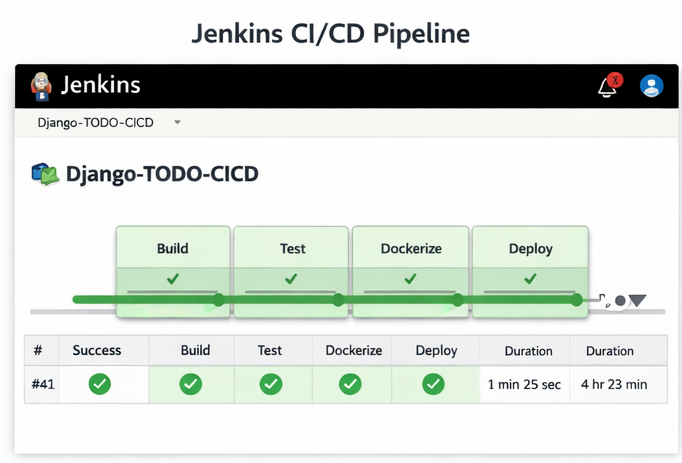
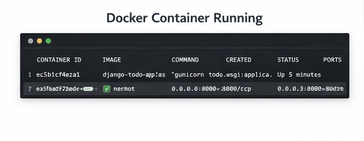
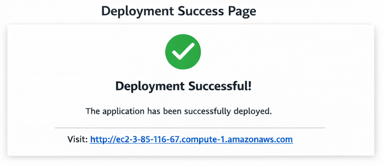

# 🚀 Django TODO App with CI/CD Pipeline

## 📌 Overview
A production-ready Django application with a fully automated CI/CD pipeline using Docker, Jenkins, and GitHub Actions.

This project demonstrates how to build, containerize, and deploy a web application with continuous integration and deployment workflows.

---

## 🏗️ Architecture

- User → Django App
- Django → SQLite / DB
- Docker → Containerization
- Jenkins & GitHub Actions → CI/CD Automation

---

## ⚙️ Tech Stack

- Backend: Django (Python)
- CI/CD: GitHub Actions, Jenkins
- Containerization: Docker
- Deployment: AWS EC2 (if used)
- Version Control: GitHub

---

## 🔄 CI/CD Pipeline Flow

1. Code pushed to GitHub
2. GitHub Actions / Jenkins triggers pipeline
3. Docker image is built
4. Container is deployed
5. Application updated automatically

---

## 🚀 Features

- Task management system
- Admin dashboard
- Containerized deployment
- Automated CI/CD pipeline

---

## 📸 Proof of Work

- GitHub Actions / Jenkins pipeline


- Running app


- Docker container


- Deployment

---

## 📦 How to Run

```bash
git clone <repo_url>
cd django-todo-cicd
docker-compose up
```

---

## 📊 Improvements (Future Work)
- Add PostgreSQL instead of SQLite
- Add authentication APIs
- Add monitoring (CloudWatch / Prometheus)

---

## 🧠 Learnings

- Implemented CI/CD pipelines using GitHub Actions and Jenkins
- Understood container lifecycle with Docker
- Learned deployment automation concepts
